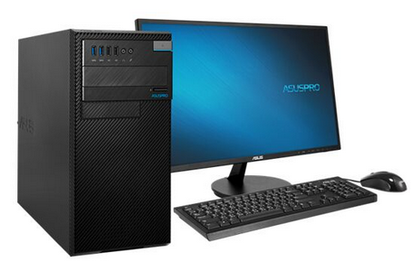
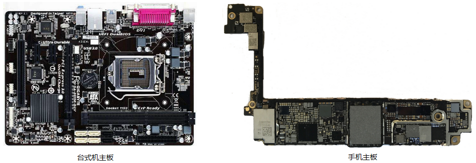
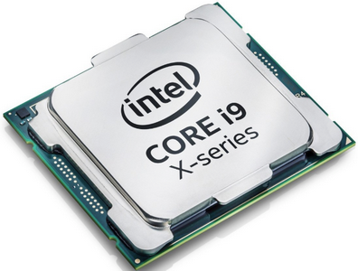
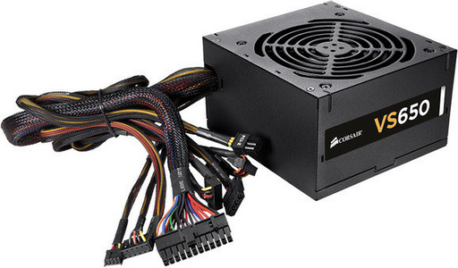
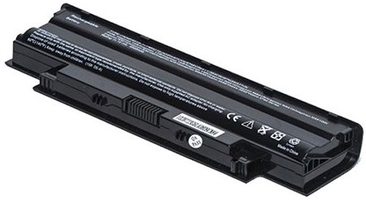
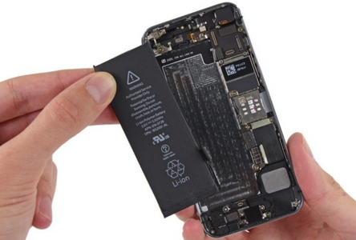
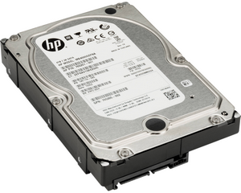
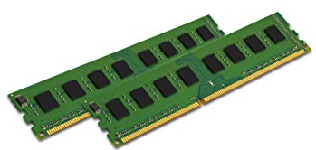
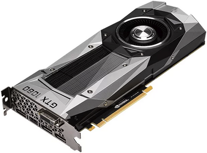
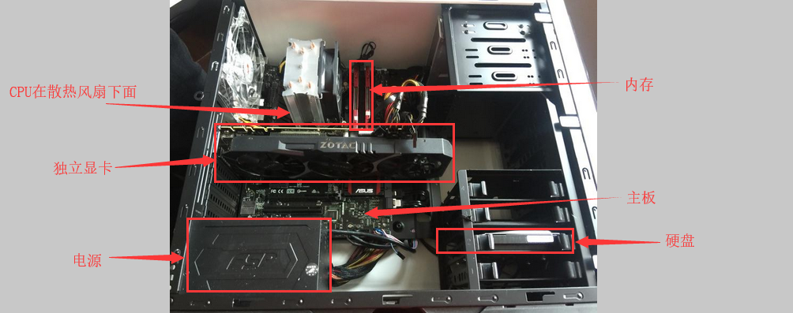

# 1.2 计算机的组成部分

虽然世界上有各种各样的计算机，但是它们的组成部分确实大同小异的。我们以台式机为例来说明计算机的组成部分。 

了解计算机的各个部件，能够帮助我们更好地理解计算机时如何工作地。另外，如果某天你的计算机不能正常工作了，你也可以大致判断问题的出处。在学习的过程中，我们不可避免会遇到一些专业术语，但是请不要担心，这些术语在你见过一两次以后也就不再陌生了。

一台计算机**至少**包含以下七个部分：

- 机箱(Computer Case)
- 主板(Motherboards)
- 中央处理单元(Central Processing Unit)，即CPU
- 电源(Power Supply)
- 硬盘(Hard Drive, HDD)
- 内存，又称随机存取存储器(Random Access Memory, RAM)
- 图像处理单元(Graphic Processing Unit, GPU)，俗称显卡

除此之外，一般的桌面计算机还配有显示器、键盘、鼠标、CD/DVD光驱、音响、摄像头等外置设备。

## 机箱

一般情况下，你身边的计算机，不管是台式电脑，笔记本还是手机，都是有外壳的。在这里我们可以把这些各种各样地外壳抽象为一类事物，那就是**机箱**。机箱的存在是为了保护和固定计算机内部的各个部件，使它们不会零零散散的四处摆放。如果我们把人的骨架比作机箱的话，那么人体内的各个器官就类似于计算机中的各个部件。

## 主板

主板是一块印刷电路板，下面左边是台式机的主板，右边是手机内的主板：

主板的作用是连接计算机中的其他部件，使所有部件形成一个系统，共同协作。没有主板，那么其他的部件之间就无法互相协作和交流。以台式机或者笔记本为例，所有的设备，不管是外部还是内部的，例如CPU、电源、打印机、显示器、鼠标、键盘、等等都直接或者间接地通过特殊地线缆连接到主板上。

目前主要的主板品牌有技嘉、华硕、微星等。

## CPU

CPU，即中央处理单元，或者中央处理器。

CPU是计算机的大脑，就像人的大脑一样，CPU接受输入(称为指令)，然后根据指令进行数学或者逻辑运算，最后将计算的结果保存在计算机的存储设备中（例如内存或者硬盘）。

生产CPU的主要厂商有Intel和AMD。

## 电源

任何计算机都需要电源，一般台式电脑的电源是这样的：

而笔记本电脑的电源可能是这样的：

而像MacBook等超薄的笔记本电脑，或者手机，它们的电源和主板结合得非常紧密，需要专业的人员才能取下来：

## 硬盘

硬盘是计算机中存储数据的地方，即使断电，其中的数据也不会丢失。平时我们使用的Word文档、视频、软件、音乐等等，都存储在硬盘中。当然，硬盘越大，那么存的东西就越多，当然价格也会越贵。

下面是台式机中的机械硬盘的样子：

生产硬盘的主要厂商有西部数据、希捷、东芝、三星等等。

## 内存

内存就像我们大脑在工作时的记忆存储区域（或者称为大脑的工作区）。比如你在做一道数学题，那么你大脑中的工作区装的就是关于这道数学题的信息，以及解这道数学题的方法。硬盘中的程序和数据都不能直接放到CPU中进行运算，需要先复制到内存中，然后计算机才能对内存中的程序和数据进行处理。

有时候你去买电脑的时候，销售人员总是会叫你买内存大的。原因就是，内存越大，那么计算机中能够同时被快速处理的数据就越多。而内存越少，那么就需要频繁地从硬盘复制数据到内存，计算完成后，再把结果存回硬盘。

断电后，内存中的数据就不见了，就像人睡觉时，工作区中就不想事情了。

另外，一些大脑研究也表明，一个人的智商跟他大脑工作区的大小有关。工作区越大，那么他能同时思考的事情就越多，也越容易做出非常突出的科学成就。

生产内存的主要厂商有金士顿、威刚、海盗船、三星等等。

## 显卡

显卡是用于图形计算的部件，它能够对图形进行实时的运算，显卡进行运算时也需要内存。

例如你在第一人称游戏里面看到的很多画面，都是通过显卡实时计算出来的。因为图形的计算和渲染需要的计算量非常大，所以现在计算机中，一般都有独立的芯片专门对图形进行处理，这个芯片就称为GPU。

当然CPU也能进行图形计算，但是CPU同时也要负责其他的运算，所以如果能把这部分任务分给GPU做，那么计算机的整体性能将会大大提升。大家常常听到的**核显**，就是集成在CPU中的图形处理单元，核显与CPU公用内存。而**独显**，就是单独插在主板上能力强大的显卡，有单独的显存，不会占用CPU使用的内存。

生产独显的主要厂商有NVDIA和AMD，核显的主要厂商为Intel和AMD。

## 其他设备

计算机除了由上述的必要部件构成之外，还有经常用到的鼠标、键盘、显示器、音响等外设。它们都是计算机的**输入**或者**输出**设备。我们通常使用这些外设和计算机进行交互。

## 小结

计算机由必要的CPU、主板、内存、硬盘、GPU、电源、机箱等组成，同时我们需要使用鼠标、键盘、触控板、显示器、音响等设备于计算机进行交互。

## 链接

- [目录](./preface.md)
- 上一节：[你身边的计算机](./01.1.md)
- 下一节：[什么是操作系统](./01.3.md)