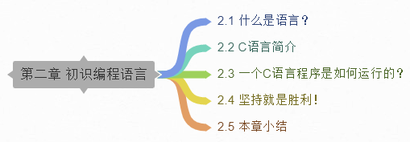

# 2 初识编程语言

在上一章，我们简要介绍了一些基础的计算机知识，最主要的有以下两点：

- 一个计算机程序是一组有限指令的集合，是保存在硬盘上的一个文件
- 程序运行的时候，程序中的指令首先从硬盘被复制到内存，接着一条条被送入CPU执行

既然你已经知道程序是一些**指令的集合**，而且是一个保存在硬盘上的**文件**（就像Word文档也是一个文件一样），那么你可能会说：编写程序不就是把这些指令一条条写出来，然后保存在一个文件里面就行了吗？

你真聪明，确实是这样的！但是其中还有很多细节我们没有介绍，这章我们就来学习什么是编程语言，C语言是什么，在哪里编写C语言程序，怎么保存C语言程序，以及用C语言编写出来的程序是如何运行的。

## 目录

## 链接

- [目录](./preface.md)
- 上一节：[第一章小结](./01.6.md)
- 下一节：[什么是语言？](./02.1.md)