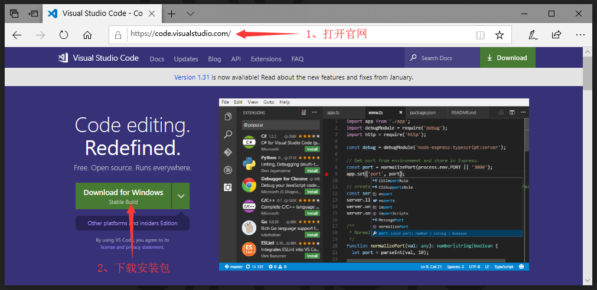
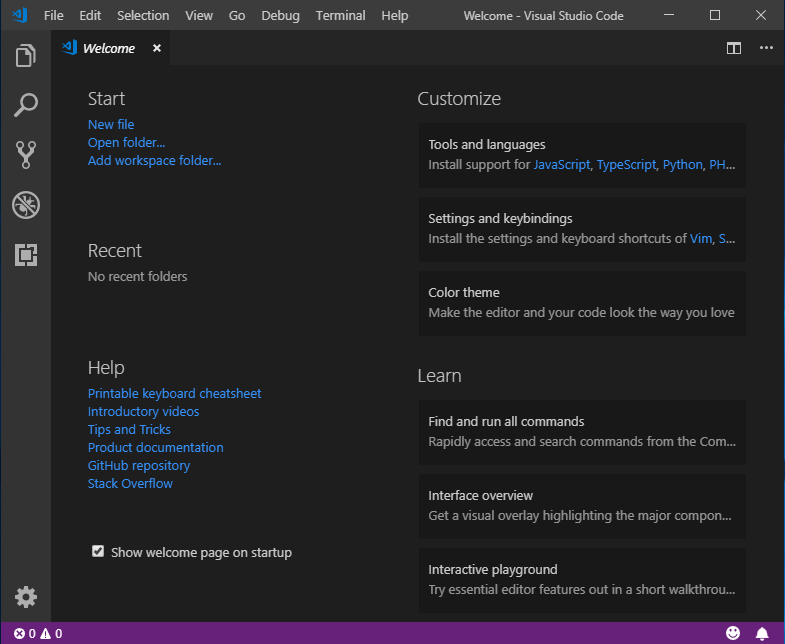

# 3.1 搭建你的编程环境(未完成)

在编写程序之前，我们应该把相应的工具准备好。

## 什么是编程环境

回忆大家在上初中或者高中的时候，我们做物理、化学或者生物实验的时候，需要准备好实验工具和环境，我们会在专门的实验教室，每人面前都有一个大大的试验台、一些试剂或相关工具。这些构成了我们的实验环境。我们要进行编程这项活动，当然也需要编程的环境。那么编程环境是什么呢？对于初学者，我们的编程环境由以下几项构成：

- 平台，即我们需要在特定的操作系统上进行编程（本教程使用Windows）
- 编辑工具，即我们编程需要的一个代码编辑器来编写代码
- 构建工具，即我们需要一些程序来将源代码转换成可执行程序
- 调试工具，即我们需要一些程序来排查程序中的错误
- 其他工具，我们可能还需要性能测试工具、用于团队合作开发的工具等（目前我们不需要了解这些）

目前也有非常多的集成开发环境(Integrated Development Environment, IDE)，也就是集合了上面各种工具的一类软件，大家一般称这些软件为IDE。例如 [Visual Studio](https://visualstudio.microsoft.com) 是由微软开发的Windows上最强大的IDE。

## 平台

在1.4节，我们介绍了选取Windows的原因：

- 初学者使用最多，最熟悉的操作系统是 Windows
- 入门的负担最轻，不需要折腾其他操作系统

## 编辑工具

代码是写出来的，所以我们当然需要一个代码编辑器啦。代码编辑器类似文本编辑器，不是IDE。目前有各种各样的编辑器可供我们使用，而且绝大部分都是免费的，下面简单罗列几个：

- [Visual Studio Code](https://code.visualstudio.com/)，简称VS Code。注意VS Code不是上面提到的Visual Studio，虽然他们都由微软开发。
- [Sublime Text 3](http://www.sublimetext.com/)
- [Notepad++](https://notepad-plus-plus.org/)
- ...

除了编辑器之外，还有很多IDE也是编程的得力工具：

- [Visual Studio](https://visualstudio.microsoft.com)
- [Code::Blocks](http://www.codeblocks.org/)
- [Eclipse](https://www.eclipse.org/downloads/)
- ...

为了帮助大家理解程序的构建过程，本教程将先使用VS Code作为代码编辑器。后面也会介绍如何使用Code::Block和Visual Studio。

另外，如果有人对初学者说：“高手都使用Vim、Emacs，你也应该使用”，或者又有人说：“高手都使用记事本的”，请不要听他们胡诌。因为对于新手来说，Vim和Emacs是非常难以掌握的，而且会耗费大量的时间去配置和学习，等你已经能够熟练的编写程序了，再去尝试也不迟。另外，记事本虽然可以用来写程序，但是效率是非常低的。古人云：工欲善其事必先利其器。不同的阶段，选择合适自己的工具才是最正确的。

## 安装VS Code

1. 下载VS Code安装包：

2. 运行安装包进行安装：

3. 启动后的界面如下：

## 构建工具

除了需要使用编辑器编写代码之外，在编写完代码之后，还需要使用构建工具将源代码构建为可执行程序。在第二章我们提到了编译器和链接器，通常这两者都是集成在同一个程序当中的，我们称为C语言的构建工具。最常用的构建工具是[GCC](https://gcc.gnu.org/)(the GNU Compiler Collection)，翻译成中文是GNU编译器套件。为了避免初学者头大，至于[GNU](https://baike.baidu.com/item/gnu/671972?fr=aladdin)是什么，这里不作过多介绍了。你只需要知道GCC是一个免费的构建工具就行了。它能将C语言编译和链接成可执行程序，GCC也支持其他语言，这里不作介绍。

另外，GCC在各个平台上都可以使用。在Windows平台上，我们使用[MinGW](http://www.mingw.org/)(Minimalist GNU for Windows)，它是GCC在Windows上面的版本。

还有相似的构建工具也可以用于在Windows上构建C语言程序：[mingw-w64](http://mingw-w64.org/doku.php)和[Cygwin](https://sourceware.org/cygwin/)。这三者的使用方法都大同小异，但本教程不讨论它们的区别，作为初学者，选择MinGW即可。

## 安装Code::Blocks

[Code::Blocks](http://www.codeblocks.org/)是一个集成开发环境，它的安装包内带有MinGW。因为后面我也会教大家使用IDE，所以安装Code::Blocks一举两得。

1. 下载Code::Blocks

2. 安装Code::Blocks

## 配置MinGW

在安装完Code::Blocks之后，MinGW也一并被安装在了你的Windows操作系统中，现在我们要配置一下MinGW中的GCC，方便我们使用它来构建程序。

## 链接

- [目录](./preface.md)
- 上一节：[第一个C语言程序](./03.0.md)
- 下一节：[编写程序](./03.2.md)